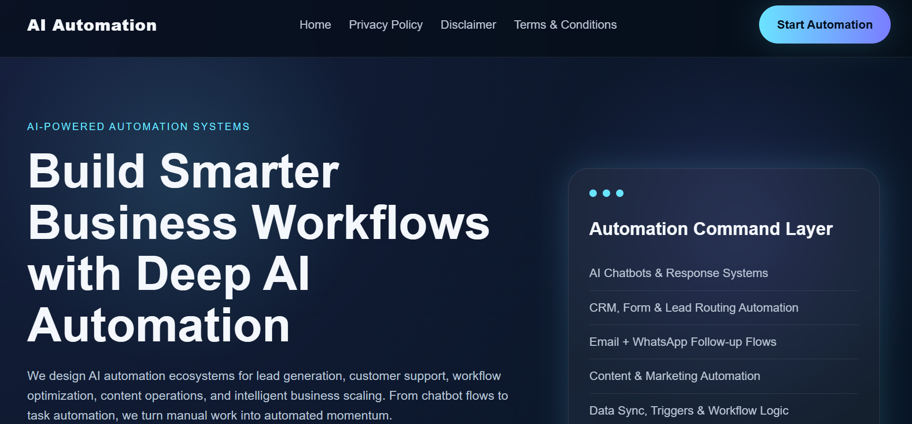
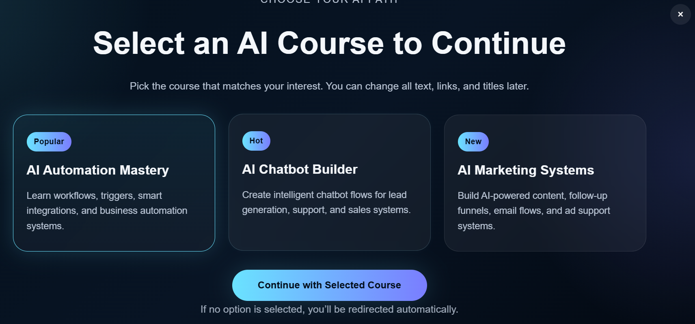

# 🚀 AI Automation Landing Page

A modern, high-converting **AI automation landing page** featuring an interactive full-screen popup, course selection system, and dynamic redirection logic built using **HTML, CSS, and JavaScript**.

---

## 🌐 Live Preview

> 🔗 Add your live website link here
> Example: https://decode-with-jai.github.io/ai-automation-landing-page/

---

## 📸 Project Preview





---

## 🧠 Project Overview

This project is designed to simulate a **real-world AI automation funnel system** used in modern digital businesses.

It includes:

* A premium landing page UI
* A full-screen popup triggered after user interaction
* Course-based selection system
* Dynamic redirection based on user choice

The goal is to combine **frontend development + automation logic + conversion-focused design**.

---

## ⚙️ Features

* 🎯 AI Automation Landing Page
* 💡 Interactive Full-Screen Popup
* 📚 Course Selection System
* 🔗 Dynamic Button Redirection
* ⏱️ Auto Redirect Logic (if no interaction)
* 📱 Fully Responsive Design
* 🎨 Modern UI/UX (Glassmorphism + Gradient Theme)

---

## 🛠️ Tech Stack

* HTML5
* CSS3
* JavaScript (Vanilla JS)

---

## 📂 Project Structure

```
aifiverautomation/
│
├── index.html
├── privacy-policy.html
├── disclaimer.html
├── terms-conditions.html
├── style.css
└── script.js
```

---

## 🚀 How It Works

1. User lands on homepage
2. After 10 seconds → popup appears
3. User selects a course
4. Button updates dynamically
5. User clicks → redirected to selected course
6. If no action → auto redirect after 3 seconds

---

## 🔧 Customization Guide

### 🔹 Change Course Links

Edit inside `index.html`:

```
data-link="https://your-course-link.com"
```

---

### 🔹 Change Popup Button Text

Edit in `index.html`:

```
Continue with Selected Course
```

---

### 🔹 Change Redirect Website

Edit inside `script.js`:

```
const MAIN_WEBSITE_URL = "https://your-main-website-link.com";
```

---

## 🎯 Use Cases

* AI Automation Services Website
* Digital Marketing Funnel
* Course Selling Landing Page
* Lead Generation System
* Affiliate Redirect System

---

## 💡 Future Improvements

* 📊 User click tracking (analytics)
* 📩 Lead capture form integration
* 🎥 Advanced animations & transitions
* 🧠 AI-based personalization
* 💰 Payment gateway integration

---

## 👨‍💻 Author

**Jai Jain**
Web Developer • Growth Strategist • Digital Builder

---

## ⭐ Support

If you like this project:

* ⭐ Star this repo
* 🔁 Share with others
* 💬 Give feedback

---

## 📌 License

This project is open-source and available for personal and commercial use.
